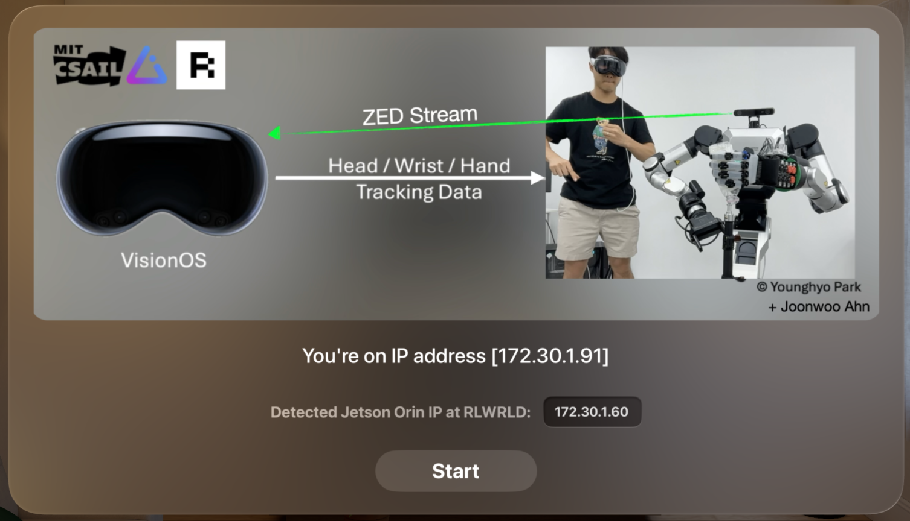

VisionProTeleop with ZED camera streaming
===========

Based on the original [VisionProTeleop](https://github.com/Improbable-AI/VisionProTeleop), this repository enhanced version adds ZED camera streaming capabilities. The original implementation enables Apple Vision Pro to connect with PC via WiFi network, allowing PC to receive head, wrist, fingers, and other tracking data from Apple Vision Pro. This extends that functionality by adding real-time streaming of ZED (2i) camera images from PC to Apple Vision Pro using WebRTC technology.

**NEW FEATURES:**
- 🎥 **Real-time ZED Camera Streaming**: Stream ZED camera footage from PC to Apple Vision Pro via WebRTC
- 🔄 **Improved Connection Stability**: Enhanced gRPC server restart logic and automatic reconnection
- 📊 **Connection Monitoring**: Real-time connection status monitoring and debugging tools
- 🛠️ **Better Error Handling**: Robust error handling with automatic retry mechanisms 

## How to Use

### Prerequisites

1. **Install Required Libraries**
   ```bash
   pip install avp_stream
   pip install -r /home/nvidia/avp_rby1_orca_teleop/VisionProTeleop/avp_stream/requirements-webrtc.txt
   ```

2. **Network Setup**
   - Ensure your PC and Apple Vision Pro are connected to the same WiFi network
   - Note your PC's IP address for streaming setup

If you use this repository in your work, consider citing:


### Step 1. Install the app on Vision Pro 



If you want to play around with the app, you can build/install the app yourself too. To learn how to do that, take a look at this [documentation](/how_to_install.md). 
This requires (a) Apple Developer Account, (b) Vision Pro Developer Strap (also connected only with wifi check at 2025.09), and (c) a Mac with Xcode installed. 
A Detail connection information bewteen MAC and Apple Vision Pro without using Vision Pro Developer Strap is introduced in https://developer.apple.com/documentation/Xcode/running-your-app-in-simulator-or-on-a-device#Connect-real-devices-to-your-Mac.


### Step 2. Start ZED Camera Streaming on PC

Before running the Vision Pro app, start the ZED camera streaming server on your PC:

```bash
source /home/nvidia/avp_rby1_orca_teleop/VisionProTeleop/venv/bin/activate
pkill -f webrtc_server.py || true; python3 /home/nvidia/avp_rby1_orca_teleop/VisionProTeleop/avp_stream/webrtc_server.py --host 0.0.0.0 --port 8086 --device 0 --width 1280 --height 720 --fps 15 | cat
```

**Parameters:**
- `--host 0.0.0.0`: Allow connections from any IP
- `--port 8086`: WebRTC streaming port
- `--device 0`: ZED camera device index
- `--width 1280 --height 720`: Stream resolution
- `--fps 15`: Frames per second

### Step 3. Run the app on Vision Pro 

After installation, click on the app on Vision Pro and click `Start`. That's it!  Vision Pro is now streaming the tracking data over your wifi network AND receiving ZED camera feed from your PC.


**Tip**  Remember the IP address before you click start; you need to specify this IP address to subscribe to the data. Once you click start, the app will immediately enter into pass-through mode with ZED camera overlay. Click on the digital crown to stop streaming.

**Connection Troubleshooting:**
- If connection fails after using the crown button, the app now automatically retries connection
- Use the connection monitor to debug issues: `python3 /home/nvidia/avp_rby1_orca_teleop/VisionProTeleop/avp_stream/connection_monitor.py`  


### Step 4. Receive the avp traking stream from anywhere


Then, add this code snippet to any of your projects you were developing: 

```python
from avp_stream import VisionProStreamer
avp_ip = "172.30.1.44"   # example IP 
s = VisionProStreamer(ip = avp_ip, record = True)

while True:
    r = s.latest
    print(r['head'], r['right_wrist'], r['right_fingers'])
```

### Enhanced Connection Features

The updated VisionProStreamer now includes improved connection stability:

```python
from avp_stream import VisionProStreamer

# Create streamer with retry configuration
streamer = VisionProStreamer(
    ip='172.30.1.44', 
    record=True,
    max_retries=10,      # Maximum retry attempts
    retry_delay=2        # Delay between retries (seconds)
)

# Check connection status
if streamer.is_connected():
    print("✅ Connected successfully!")
    latest_data = streamer.get_latest()
else:
    print("❌ Connection failed - retrying...")
    streamer.reconnect()  # Manual reconnection
```


## Available Data

```python
r = s.latest
```

`r` is a dictionary containing the following data streamed from AVP: 

```python
r['head']: np.ndarray  
  # shape (1,4,4) / measured from ground frame
r['right_wrist']: np.ndarray 
  # shape (1,4,4) / measured from ground frame
r['left_wrist']: np.ndarray 
  # shape (1,4,4) / measured from ground frame
r['right_fingers']: np.ndarray 
  # shape (25,4,4) / measured from right wrist frame 
r['left_fingers']: np.ndarray 
  # shape (25,4,4) / measured from left wrist frame 
r['right_pinch_distance']: float  
  # distance between right index tip and thumb tip 
r['left_pinch_distance']: float  
  # distance between left index tip and thumb tip 
r['right_wrist_roll']: float 
  # rotation angle of your right wrist around your arm axis
r['left_wrist_roll']: float 
 # rotation angle of your left wrist around your arm axis
```


### Axis Convention & Hand Skeleton used in VisionOS
These are refered in https://github.com/Improbable-AI/VisionProTeleop.

## Troubleshooting & Monitoring

### Connection Monitor

Use the built-in connection monitor to debug connectivity issues:

```bash
# Basic monitoring
python3 /home/nvidia/avp_rby1_orca_teleop/VisionProTeleop/avp_stream/connection_monitor.py

# Custom IP and settings
python3 /home/nvidia/avp_rby1_orca_teleop/VisionProTeleop/avp_stream/connection_monitor.py --ip 172.30.1.44 --port 12345 --interval 1
```

The monitor provides real-time status:
- ✅ **Connected**: Network and gRPC server both working
- ⚠️ **Partial**: Network OK but gRPC server not running
- ❌ **Failed**: Network connectivity issues

### Common Issues & Solutions

1. **Connection fails after crown button exit**
   - **Solution**: The app now automatically retries connection when returning from background
   - **Manual fix**: Restart the Vision Pro app

2. **ZED camera not streaming**
   - **Check**: Ensure WebRTC server is running on PC
   - **Verify**: Camera permissions and device index (usually 0)
   - **Test**: Check if camera works with other applications

3. **gRPC connection timeout**
   - **Check**: Both devices on same WiFi network
   - **Verify**: Correct IP address (check Vision Pro settings)
   - **Monitor**: Use connection monitor tool for detailed diagnostics

4. **Port binding errors**
   - **Solution**: Updated server automatically handles port cleanup
   - **Manual fix**: Restart the application

### System Requirements

- **Apple Vision Pro**: visionOS 1.0+
- **PC**: Python 3.8+, OpenCV, ZED SDK
- **Network**: Stable WiFi connection (5GHz recommended)
- **Hardware**: ZED camera (for video streaming feature) 

## Acknowledgements

This project is based on the original [VisionProTeleop](https://github.com/Improbable-AI/VisionProTeleop) by Improbable AI, which provides the core Apple Vision Pro head, wrist, and finger tracking functionality via gRPC streaming.

**Original VisionProTeleop Citation:**
```
@software{park2024avp,
    title={Using Apple Vision Pro to Train and Control Robots},
    author={Park, Younghyo and Agrawal, Pulkit},
    year={2024},
    url = {https://github.com/Improbable-AI/VisionProTeleop},
}
```

**Our Enhancements:**
- Real-time ZED camera streaming via WebRTC
- Improved connection stability and automatic reconnection
- Enhanced error handling and monitoring tools
- Extended documentation and troubleshooting guides

